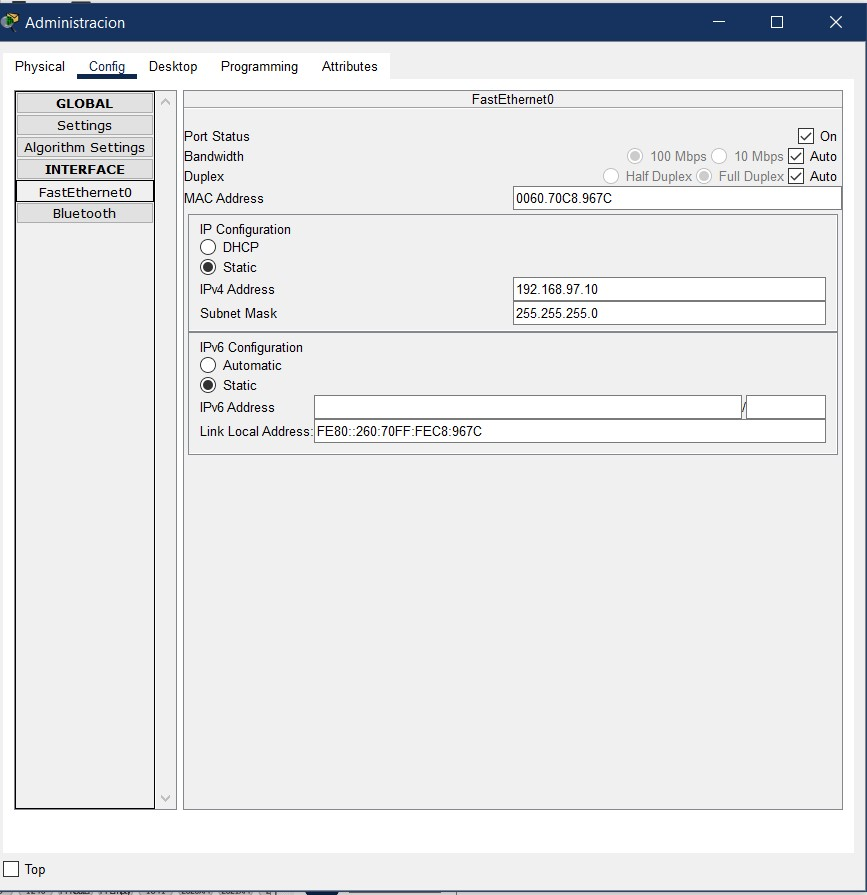
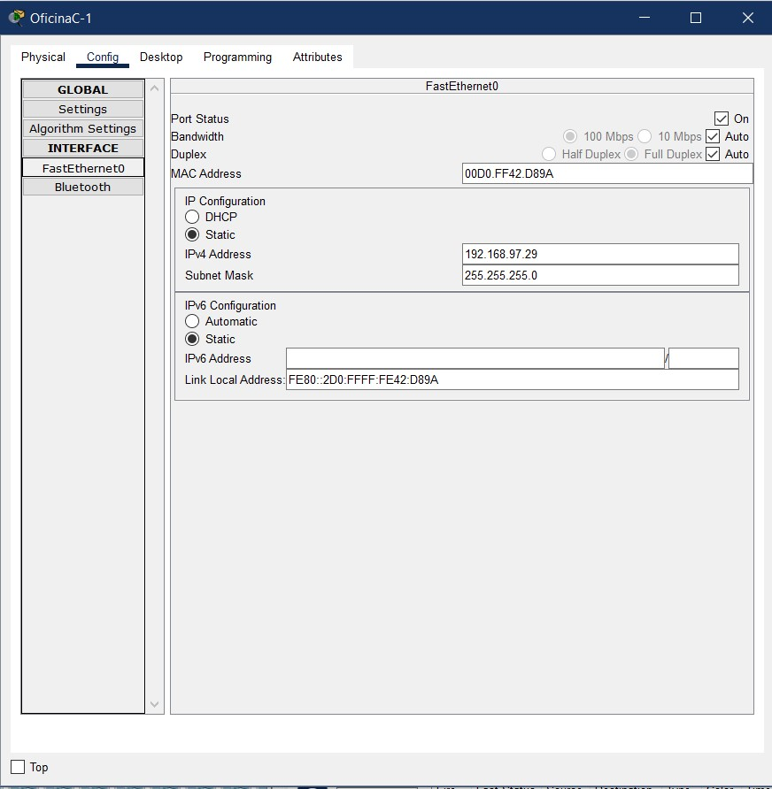

~~~
Universidad San Carlos de Guatemala 2024
Redes de computadoras 1
Lesther Kevin Federico López Miculax - 202110897
~~~

# Practica 1

## Configuración de las VPCs

 

Configuracion correspondiente a la VPC de administracion

 

Configuracion correspondiente a una VPC de atencion al cliente

 

Configuracion correspondiente a una VPC de gerencia

 

Configuracion correspondiente a una VPC de recursos humanos

 

Configuracion correspondiente a una VPC de la oficina A

 

Configuracion correspondiente a una VPC de la oficina B

 

Configuracion correspondiente a una VPC de la oficina C

##  Pings entre los hosts

 

Comunicacion entre el area de administracion en el primer nivel y el area de la oficina C en el segundo nivel

 

Comunicacion entre la oficina A en el segundo nivel y el area de Atencion al Cliente ubicado en el primer nivel

 

Comunicacion entre recursos humanos y la oficina B

##  Demostración de la captura de un paquete ARP/ICMP

Simulación de la captura de un paquete desde la VPC del administrador al VPC 1 de la oficina 1
