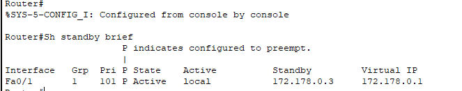

~~~
Universidad San Carlos de Guatemala 2024
Redes de computadoras 1
Lesther Kevin Federico López Miculax - 202110897
~~~

# Practica 2

## Configuracion de routers R1, R2 Y R5

Los routers R1, R2 Y R5 tienen diversas configuraciones, las primeras de ellas son las direcciones ips configuradas en cada una de ellas y sus interfaces.

ips configuradas de R1


ips configuradas de R2


ips configuradas de R5


Los tres routers tambien tienen en sus configuracions la implementacion de rutas estaticas, las cuales se muestran a continuacion:

rutas estaticas de R1


rutas estaticas de R2


rutas estaticas de R5


Por otro lado, en los R2 y R5 se colocó la configuración HSRP, por lo que se muestran en las siguientes imagenes estas configuraciones realizadas:

HSRP de R2


HSRP de R5




## Configuración de switch S1

Dentro del switch S1 y su configuración se encuentra el Port-Channel realizado con PAGP, de este modo, se muestra en la siguiente imagen.


## Configuración de VPC11

El VPC11 utilizó la siguiente configuración, donde se colocó su respectiva dirección ip, mascara de subred y dirección de enlace.


Configuración de vpc11

## Comandos Utilizados

### Creación de ruta estática

En primera instancia, se colocaron la ip en cada una de las interfaces de los routers con los siguientes comandos

```console
enable
config t
int f#/#
ip address 172.168.0.2 255.255.255.0
no shutdown
```

En este comando se especifica la dirección ip que tendra la interfaz (172.168.0.2) y la mascara de subred (255.255.255.0)

Posteriormente, se procedió a establecer las rutas estáticas para cada router. Para ello, se utilizó el siguiente comando con valores específicos en cada router:

```console
ip route 192.167.0.0 255.255.255.252 192.167.0.1
```
En este comando, la dirección IP de destino (192.167.0.0) representa la red de destino a la que se desea enviar el tráfico, mientras que la máscara de subred (255.255.255.252) especifica la longitud de prefijo de dicha red. Finalmente, la dirección IP del siguiente salto (192.167.0.1) indica la próxima dirección IP a la que se debe enviar el tráfico para alcanzar la red de destino.


### Creación de PortChannel PAGP

En la pareja de switches SW0-SW1 se implementó PAGP para el port-channel de estos switches. La implementación de PAGP en la pareja de switches SW0-SW1 mejoró la capacidad de la red al tiempo que proporcionó redundancia y alta disponibilidad para el tráfico de datos entre los switches.

1. SW0 
    ```console
    conf t
    interface range f#/# - #
    channel-group # mode desirable
    no shutdown
    ```
2. SW1
    ```console
    conf t
    interface range f#/# - #
    channel-group # mode auto
    no shutdown
    ```


### Creación de PortChannel LACP

En la pareja de switches SW2-SW3 se implementó con LACP el PortChannel. LACP es un protocolo que permite la agregación de varios enlaces físicos entre dos dispositivos de red para formar un único enlace lógico de mayor ancho de banda y redundancia.

Por consiguiente, se implementaron los siguientes comandos en los switches SW2-SW3

1. SW2
    ```console
    conf t
    interface range f#/# - #
    channel-group # mode active
    end
    ```
2. SW3
    ```console
    conf t
    interface range f#/# - #
    channel-group # mode passive
    end
    ```

### IP virtual con HSRP

Las IP virtuales se crearon haciendo uso de la configuración HSRP en las parejas de routers R2-R3 y R5-R6. Al implementar HSRP, se establece una dirección IP virtual compartida entre los routers de cada pareja,  lo que garantiza que siempre haya un router activo para manejar el tráfico mientras que el otro permanece en espera para tomar el control en caso de que falle el router activo.

Para configurar HSRP se ingresa a la interfaz requerida y se colocan los comandos que se muestran a continuación en los routers que tendra mayor prioridad dentro de la pareja, es decir, el que se desea que este activo:

```console
standby 1 ip 172.168.0.4
standby 1 priority 101
standby 1 preempt
no shutdown
```

Posteriormente, en los routers complementarios, en este caso, los routers R5 y R6 se coloca el HSRP en modo standby 

```console
standby 1 ip 172.168.0.4
no shutdown
```

### Configuración de VPC


La configuración de las VPC se realizó de manera cuidadosa, asignando a cada una de ellas direcciones IP únicas y adecuadas para su entorno. Además, se configuró la puerta de enlace correspondiente a cada VPC para facilitar la comunicación dentro y fuera de la red virtual.

 

Configuración de vpc11

 

Configuración de vpc12

## Comnados de verificación

### IPS CONFIGURADAS
Para poder visualizar un resumen de las **Ips configuradas en las interfaces**
```console
sh ip int brief
```

### PORT-CHANNEL

Para mostrar la configuracion de **Port-Channel** en los switches se puede hacer de dos formas.

```console
show etherchannel port-channel
```
```console
show etherchannel summary
```

### HSRP

Para verificar la configuración **HSRP** en las parejas de  routers.
```console
sh standby brief
```

### RUTAS ESTATICAS

Finalmente, para verficar las **rutas estaticas** que se implementaron para garantizar la comunicación en ambas
vías entre VPC11 y VPC12.

```console
do show run | section ip route
```