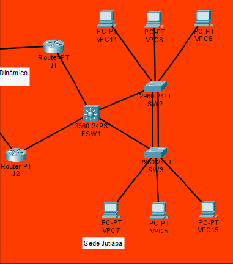
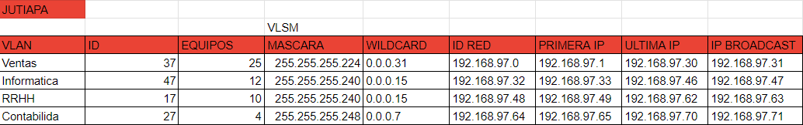
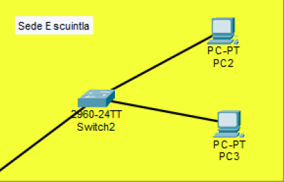
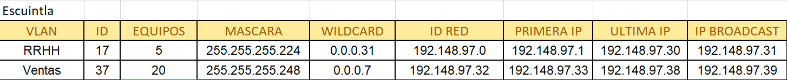
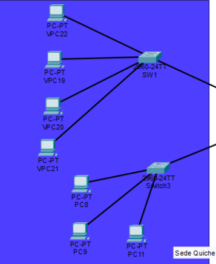
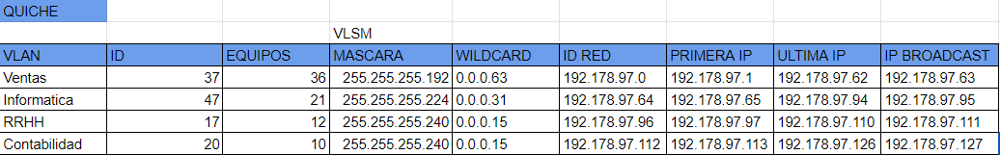
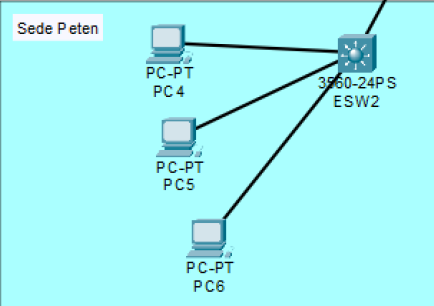
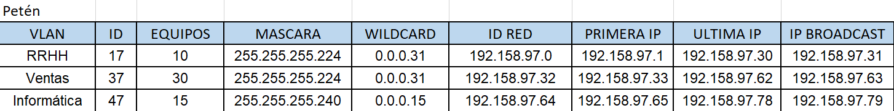
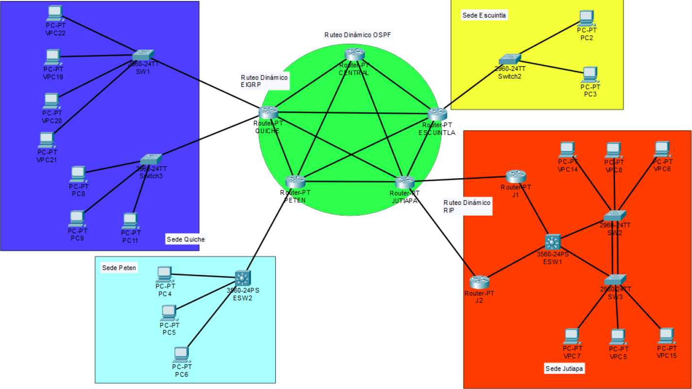

~~~
Universidad San Carlos de Guatemala 2024
Redes de computadoras 1
Lesther Kevin Federico López Miculax - 202110897
Diego Abraham Robles Meza - 201901429
~~~

# Manual Técnico

## Sede de Jutiapa



- Configuracion de ID de red:

    Tomando como base los ultimos digitos del número de carnet del solicitante se completó el ID de red, como se muestra a continuación:

    192.168.XX.32

    Los ultimos dos digitos del carnet son => 97

    Por lo tanto el ID de red queda de la siguiente manera: 

    192.168.97.32

    Y para la asignacion de VLANs se utilizó el último digito del carnet del solicitante, en este caso 7.



- Configuracion de las VLAN

    ```
    vlan 37
    name ventas
    exit
    vlan 47
    name informatica
    exit
    vlan 17
    name RRHH
    exit
    vlan 27
    name  Contabilidad
    exit
    ```

    Corroboramos que se hallan creado correctamente las vlans

    ```
    do sh vlan
    ```

    Asignamos cada vlan a un puerto
    ```
    int fa#/#
    switchport mode access
    switchport access vlan 37

    int fa#/#
    switchport mode access
    switchport access vlan 47

    int fa#/#
    switchport mode access
    switchport access vlan 17

    int fa#/#
    switchport mode access
    switchport access vlan 27

    do wr
    ```

- Configuración LACP Switches SW2 y SW3

    En la pareja de switches SW2-SW3 se implementó con LACP el PortChannel. LACP es un protocolo que permite la agregación de varios enlaces físicos entre dos dispositivos de red para formar un único enlace lógico de mayor ancho de banda y redundancia.

    Por consiguiente, se implementaron los siguientes comandos en los switches SW2-SW3

    1. SW2
        ```console
        conf t
        interface range f#/# - #
        channel-group # mode active
        end
        ```
    2. SW3
        ```console
        conf t
        interface range f#/# - #
        channel-group # mode passive
        end
        ```

- Configuración HSRP en Routers J1 y J2

    Las IP virtuales se crearon haciendo uso de la configuración HSRP en las parejas de routers J1-J2. Al implementar HSRP, se establece una dirección IP virtual compartida entre los routers de cada pareja,  lo que garantiza que siempre haya un router activo para manejar el tráfico mientras que el otro permanece en espera para tomar el control en caso de que falle el router activo.

    Para configurar HSRP se ingresa a la interfaz requerida y se colocan los comandos que se muestran a continuación en los routers que tendra mayor prioridad dentro de la pareja, es decir, el que se desea que este activo:

    1. J1
        ```console
        standby 1 ip 172.168.97.4
        standby 1 priority 101
        standby 1 preempt
        no shutdown
        ```

    2. J2
        ```console
        standby 1 ip 172.168.97.4
        no shutdown
        ```

- Configuración de ESW1

    activamos los puertos que hacen conexión entre el router y los switches

    ```cmd
    # primer puerto
    enable
    conf t
    int fa#/#
    no shut

    # Segundo puerto
    int fa#/#
    no shut
    ```

    Configuracion en las subinterfaces
    ```
    int f#/#.#
    encapsulation dot1q #
    ip address 192.168.97.0 255.255.255.224
    no shutdown
    exit 
    ```

## Sede Escuintla


- Configuracion de ID de red:

    Tomando como base los ultimos digitos del número de carnet del solicitante se completó el ID de red, como se muestra a continuación:

    192.148.XX.0

    Los ultimos dos digitos del carnet son => 97

    Por lo tanto el ID de red queda de la siguiente manera: 

    192.148.97.0

    Y para la asignacion de VLANs se utilizó el último digito del carnet del solicitante, en este caso 7.



- Configuracion de switches
    Switch0
    ```
    conf t
    spanning-tree mode rapid-pvst
    ```

## Sede Quiche




## Sede Petén


- Configuracion de ID de red:

    Tomando como base los ultimos digitos del número de carnet del solicitante se completó el ID de red, como se muestra a continuación:

    192.158.XX.0

    Los ultimos dos digitos del carnet son => 97

    Por lo tanto el ID de red queda de la siguiente manera: 

    192.158.97.0

    Y para la asignacion de VLANs se utilizó el último digito del carnet del solicitante, en este caso 7.



- Configuracion de ESW2


    ```
    conf t
    spanning-tree mode rapid-pvst
    ```

    ## Sede Petén

- Configuración de ESW2

    ```console
    conf t
    vlan 1Y
    name RRHH
    exit
    vlan 3Y
    name Ventas
    exit
    vlan 4Y
    name Informatica
    exit

    vtp domain Peten
    vtp mode server
    vtp password Peten

    spanning-tree mode rapid-pvst

    interface vlan 1Y
    ip address 192.158.97.1 255.255.255.0
    exit
    interface vlan 3Y
    ip address 192.158.97.2 255.255.255.0
    exit
    interface vlan 4Y
    ip address 192.158.97.3 255.255.255.0
    exit

    int fa#/#
    switchport mode access
    switchport access vlan 17

    int fa#/#
    switchport mode access
    switchport access vlan 37

    int fa#/#
    switchport mode access
    switchport access vlan 47

    do wr
    ```
## Core 
Para la implementacion del core se hizo uso de diversos tipos de ruteo y para esto se implementó FLSM, por lo que se obtuvo la siguiente tabla

| Equipos | Mascara         | Wildcard | Id Red     | Primera IP | Ultima IP  | IP Broadcast |
|---------|-----------------|----------|------------|------------|------------|--------------|
| 62      | 255.255.255.192 | 0.0.0.63 | 10.0.0.0   | 10.0.0.1   | 10.0.0.62  | 10.0.0.63    |
| 62      | 255.255.255.192 | 0.0.0.63 | 10.0.0.64  | 10.0.0.65  | 10.0.0.126 | 10.0.0.127   |
| 62      | 255.255.255.192 | 0.0.0.63 | 10.0.0.128 | 10.0.0.129 | 10.0.0.190 | 10.0.0.191   |
| 62      | 255.255.255.192 | 0.0.0.63 | 10.0.0.192 | 10.0.0.193 | 10.0.0.254 |  10.0.0.255  |

### Topología completa del proyecto

