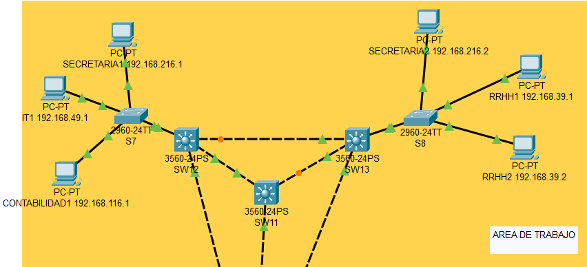
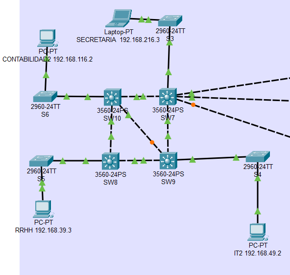
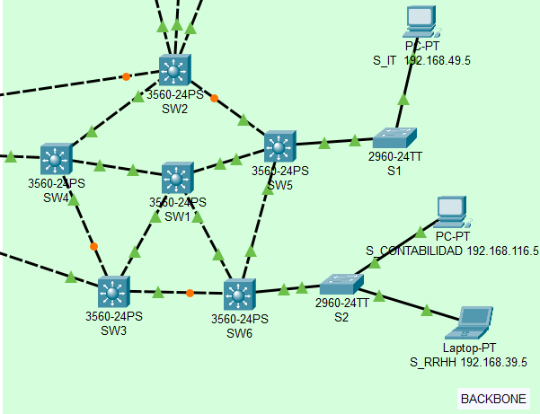
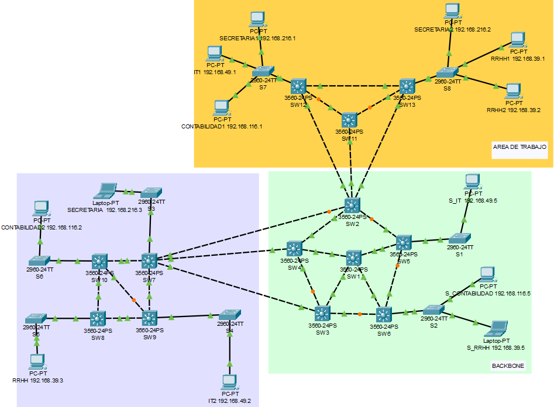
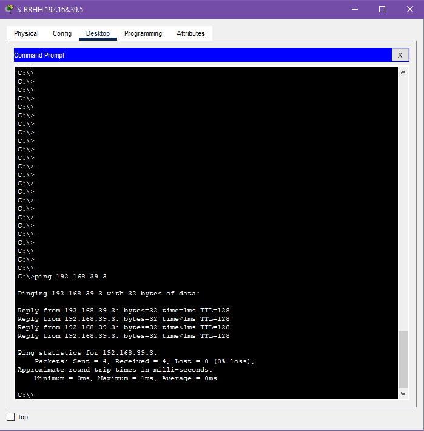
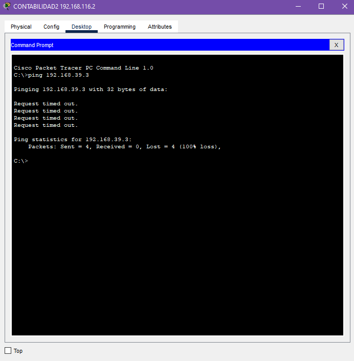

# Manual Tecnico

## Integrantes

|               Nombre                  |   Carné    |
|:--------------------------------------|:----------:|
| Diego Abraham Robles Meza             | 201901429  |
| Lesther Kevin Federico López Miculax  | 202110897  |

## Resumen de Direcciones IP y Vlan

    Explicación:  
    Se toma el último dígito de su número decarné como base.

    Por ejemplo estudiante 1 (202020120), último dígito es 0, estudiante 2 (201901395), último digito es 5  
    Se reemplaza la X por la suma de ambos dígitos, por lo que la VLAN del departamento de Contabilidad sería 15.

    Aplicacion: Carnets => 201901429, 202110897 => X = 9 + 7, X = 16.

| Departamento  | VLAN  | Id de red       |
|:--------------|:-----:|:---------------:|
| Contabilidad  | 1X    | 192.168.1X.0/24 |
| Secretaria    | 2X    | 192.168.2X.0/24 |
| RRHH          | 3X    | 192.168.3X.0/24 |
| IT            | 4X    | 192.168.4X.0/24 |

    Por lo tanto quedarían de la siguiente manera:

| Departamento  | VLAN  | Id de red        |
|:--------------|:-----:|:----------------:|
| Contabilidad  | 116   | 192.168.116.0/24 |
| Secretaria    | 216   | 192.168.216.0/24 |
| RRHH          | 316   | 192.168.316.0/24 |
| IT            | 416   | 192.168.416.0/24 |

### Nota

    Al reemplazar la X en las configuraciones RRHH e IT sobrepasaba el limite para las IPs,  
    por lo tanto se decidió asignar 39 y 49 respectivamente.

    Quedando de la siguiente manera:

| Departamento  | VLAN  | Id de red        |
|:--------------|:-----:|:----------------:|
| Contabilidad  | 116   | 192.168.116.0/24 |
| Secretaria    | 216   | 192.168.216.0/24 |
| RRHH          | 39    | 192.168.39.0/24  |
| IT            | 49    | 192.168.49.0/24  |

## Capturas de la implementación de las topologías

### Backbone



Centro Administrativo



### Area de trabajo



### Vista general topologías



### Detalle de los comandos usados

```C#
// Accediendo al modo exec privilegiado
enable

// Accediendo al modo de configuración global
conf t

// Estableciendo el nombre del switch como "SW1"
hostname SW1

/* 
    SWITCH ROOT
    Configurar el switch como Server y Root.
*/

// Server
conf t 
vtp domain P27
vtp password P27
vtp version 2 
vtp mode server


conft t

vlan 116
name Contabilidad
exit 

vlan 216
name Secretaria
exit 

vlan 36
name RRHH
exit 

vlan 46
name IT
exit 

// switch root
int f0/1
switchport mode trunk
switchport trunk allowed vlan 116,216,316,416,1002-1005
switchport trunk encapsulation dot1q

int f0/2
switchport mode trunk
switchport trunk allowed vlan 116,216,316,416,1002-1005
switchport trunk encapsulation dot1q

int f0/3
switchport mode trunk
switchport trunk allowed vlan 116,216,316,416,1002-1005
switchport trunk encapsulation dot1q

int f0/4
switchport mode trunk
switchport trunk allowed vlan 116,216,316,416,1002-1005
switchport trunk encapsulation dot1q

// Se configuran las VLAN para que pertenezcan al Root Bridge.

conf t
spanning-tree vlan 1 root primary
spanning-tree vlan 116 root primary
spanning-tree vlan 216 root primary
spanning-tree vlan 39 root primary
spanning-tree vlan 49 root primary

// Configuración de los switches que estarán en modo cliente

conf t 
vtp domain P27
vtp password P27
vtp version 2 
vtp mode client


// Configuración de los puertos en modo access para dispositivos finales
conf t
vtp version 2
vtp domain P27
vtp mode client

etc...

//

conf t
spanning-tree mode rapid-pvst
```

### Ping entre hosts

    Ping desde 192.168.39.5 hacia 192.168.39.3



    Ping desde 192.168.116.2 hacia 192.168.39.3

